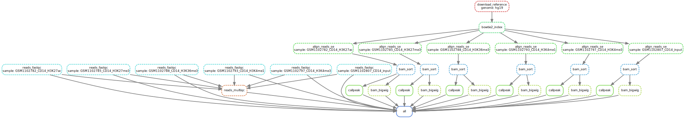
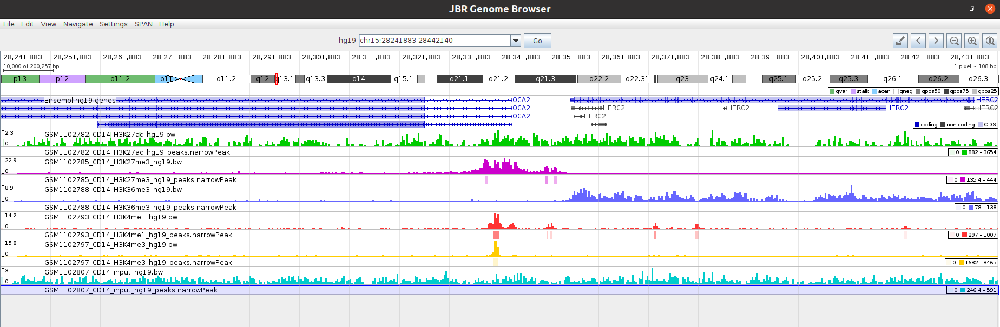
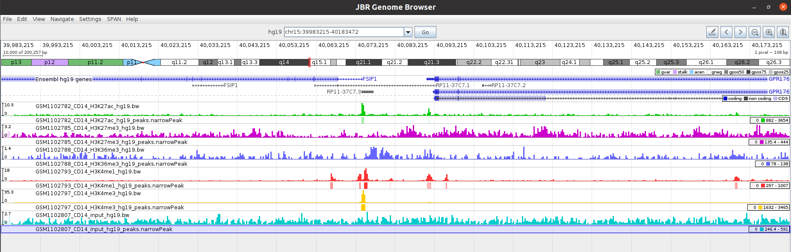
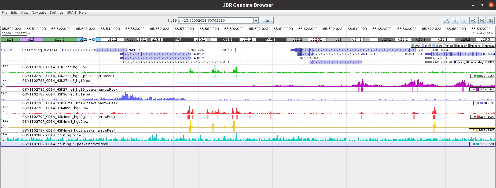

# ChIP-Seq task

## Link to the google drive *(chip_seq_results.tar.gz)*:

https://drive.google.com/file/d/1ayERj2xGMIIHm9oPnYLc09oaKriyoeiq/view?usp=sharing

## New *dag.svg* and *rulegraph.svg*




## Promoter regions in JBR Genome Broeser

### example 1



### example 2



### example 3




```python

```
